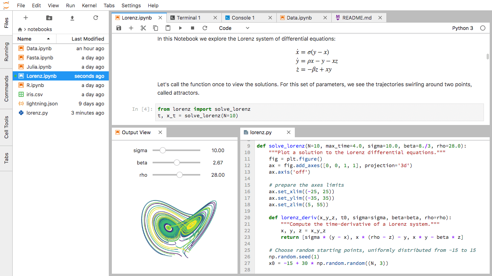
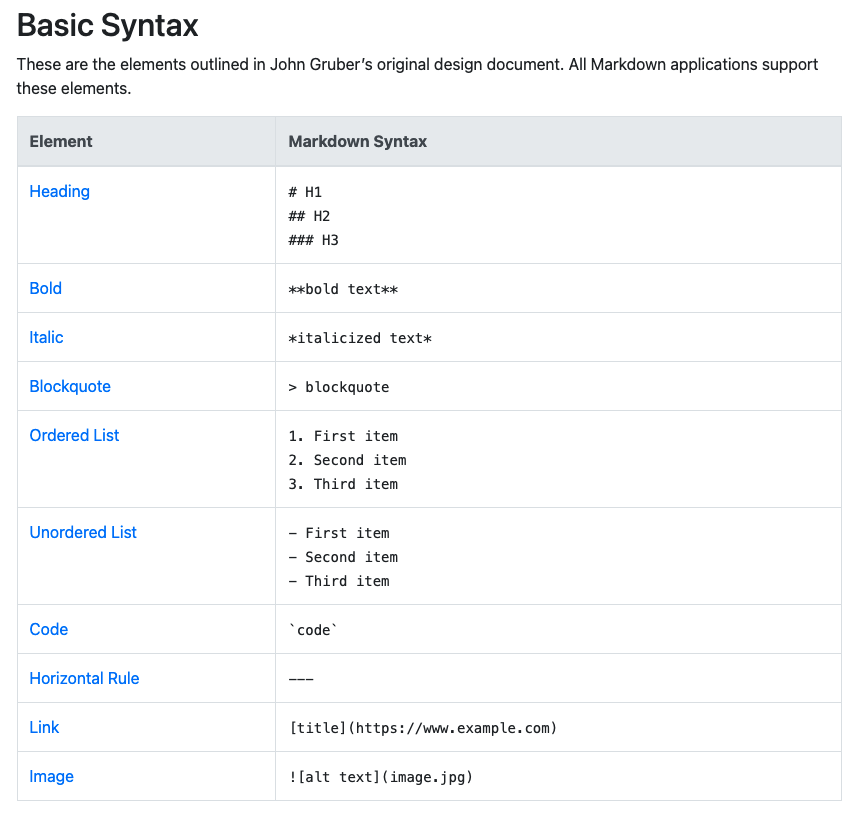

## Jupyterlab

JupyterLab is the latest web-based interactive development environment for notebooks, code, and data. Its flexible interface allows users to configure and arrange workflows in data science, scientific computing, computational journalism, and machine learning.

More details: [https://jupyter.org/](https://jupyter.org/)

## Jupyterlab Interface



## Jupyterlab shortcut commands

Hide the  file browser section

1. Windows = control
2. Mac = commad

Create cell above = A
Breate cell below = B

Go up or down any cell use arrow key

Press DD to delete cells


# Learning Mardown

### Hello World

to make text different sizes you can use ## 

**hello world**

**What is Markdown?**

Markdown is a lightweight markup language that you can use to add formatting elements to plaintext text documents. Created by John Gruber in 2004, Markdown is now one of the world’s most popular markup languages.

More details: [https://www.markdownguide.org/](https://www.markdownguide.org/)



# Basic Python

https://scipy-lectures.org/intro/language/basic_types.html#numerical-types

### Numerical types

A Python shell can therefore replace your pocket calculator, with the basic arithmetic operations:
1. "+" = Sum,
2. "-" = Subtract,
3. "*" = Multiplication, 
4. "/" = Division, 
5. "%" = Modulo natively implemented 


```python
7 * 3.
```


    21.0


```python
type(7)
```


    int


```python
type(3.50)
```


    float


```python
7*3.5
```


    24.5


```python
2**10
```


    1024


```python
7+3
```


    10


```python
8 % 3
```


    2


```python
10% 3
```


    1


```python
7/3
```


    2.3333333333333335


#### Type conversion (casting):


```python
float(1)
```


    1.0


#### Integer division


```python
3 / 2 
```


    1.5


### Containers
1. List
2. Strings
3. Dictionary
4. Tuple


```python
import pandas as pd
```


```python
pd.read_csv()
```


```python
peagan = 10
jose = 25

```


```python
peagan*jose
```


    250


```python
peagan = 2
jose = 14
```


```python
peagan**jose
```


    16384


names represent variables


```python

```
